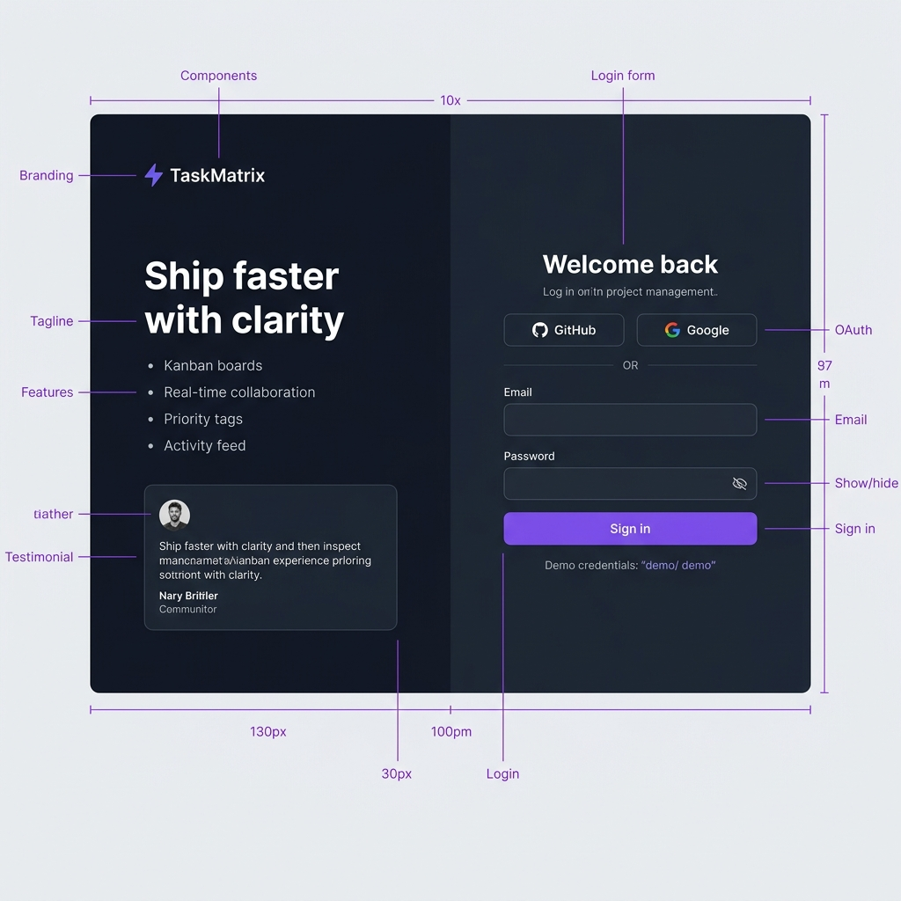
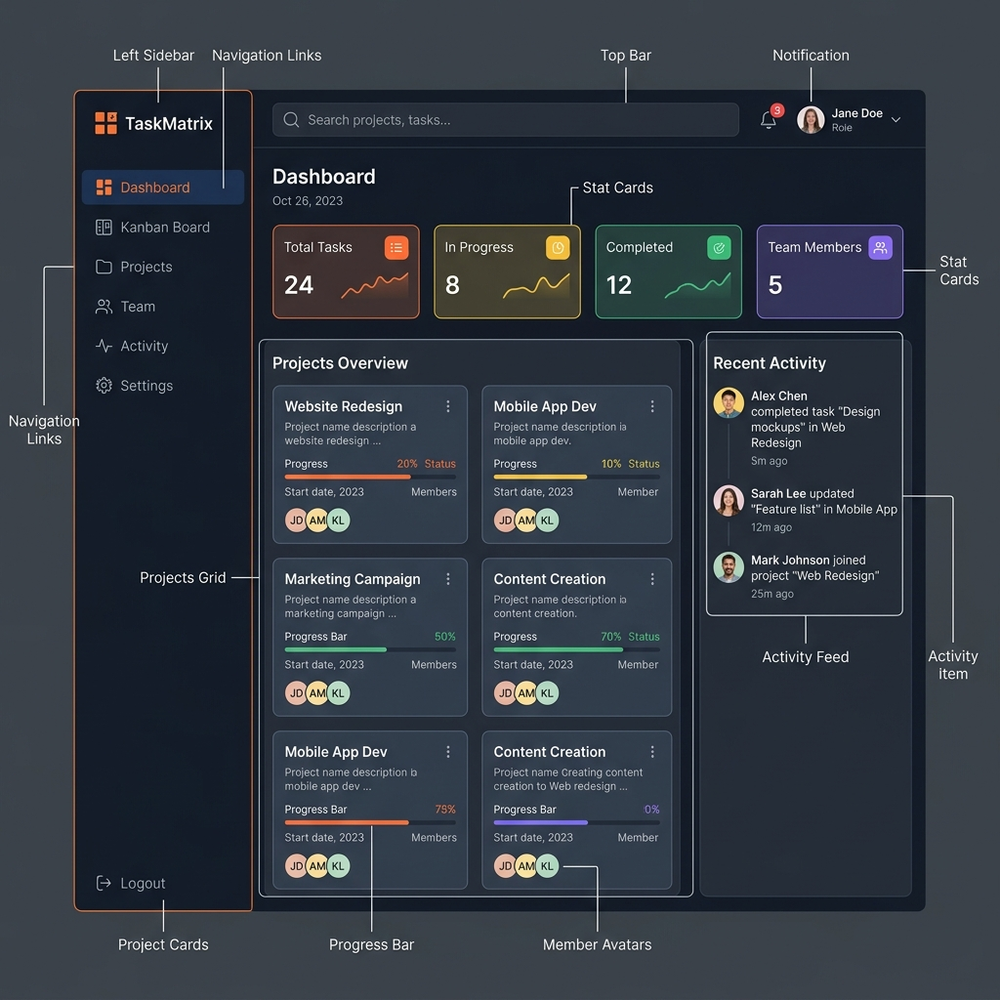
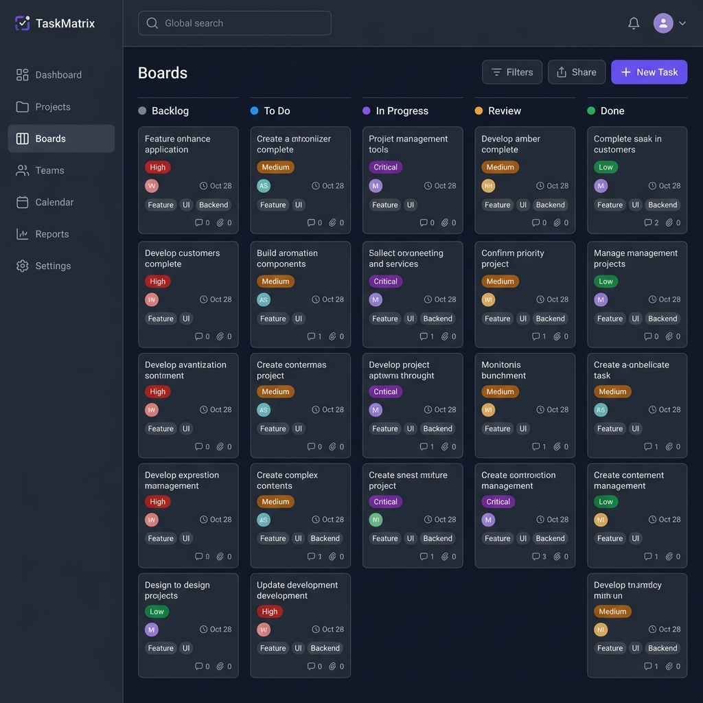
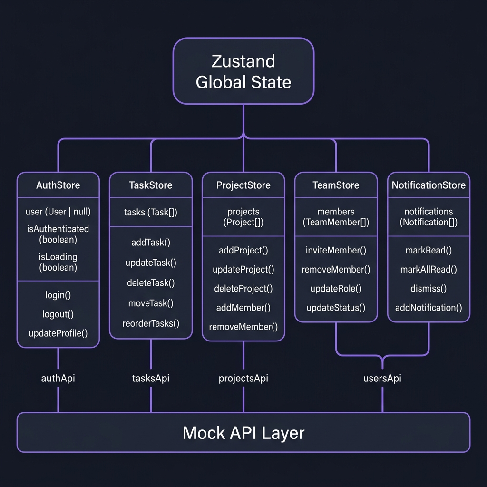

<div align="center">

# ⚡ TaskMatrix

### **A Modern Project Management Tool for Software Teams**

*Jira/Asana-inspired Kanban workspace — built as a Capstone project*

[](https://nextjs.org/)
[](https://react.dev/)
[](https://tailwindcss.com/)
[](https://www.typescriptlang.org/)
[](https://zustand-demo.pmnd.rs/)

</div>

---

## 📋 Table of Contents

1. [Project Overview](#-project-overview)
2. [Track & Role](#-track--role)
3. [Tech Stack](#-tech-stack)
4. [Core Features](#-core-features)
5. [UI Wireframes (Figma)](#-ui-wireframes)
6. [State Architecture Diagram](#-state-architecture-diagram)
7. [Mock API Endpoints](#-mock-api-endpoints)
8. [Data Models](#-data-models)
9. [Folder Structure](#-folder-structure)
10. [Development Timeline](#-development-timeline)
11. [Getting Started](#-getting-started)

---

## 🎯 Project Overview

**TaskMatrix** is a commercial-grade project management application inspired by tools like **Jira**, **Asana**, and **Linear**. It provides software teams with an intuitive Kanban-based workflow to organize tasks, track sprint progress, manage team members, and stay aligned on deadlines.

### Why TaskMatrix?

| Pain Point | TaskMatrix Solution |
|---|---|
| Scattered tasks across tools | Unified Kanban board with 5 status columns |
| No visibility into team workload | Dashboard with real-time stats & activity feed |
| Rigid project management tools | Drag-and-drop cards, inline editing, priority tags |
| Complex onboarding | One-click demo login, clean modern UI |

### Target Users
- **Software development teams** (3–20 members)
- **Project managers** tracking sprint progress
- **Designers** collaborating on cross-functional projects
- **Freelancers** managing client deliverables

---

## 👤 Track & Role

| Field | Detail |
|---|---|
| **Track** | 🎨 **Frontend** |
| **Intern** | Individual Capstone |
| **Data Strategy** | Mock data via Zustand stores + simulated API service layer (no backend) |

> Since this is a **Frontend track** project, there is no real backend/database. All data is managed through client-side **Zustand stores** with a **Mock API layer** (`src/lib/api.ts`) that simulates REST endpoints with realistic delays. This architecture allows seamless migration to a real backend in the future by simply replacing the mock functions with `fetch()` calls.

---

## 🛠 Tech Stack

| Layer | Technology | Purpose |
|---|---|---|
| **Framework** | Next.js 16 (App Router) | File-based routing, SSR/SSG, layouts |
| **UI Library** | React 19 | Component architecture |
| **Language** | TypeScript 5 | Type safety across the codebase |
| **Styling** | Tailwind CSS 4 | Utility-first CSS framework |
| **Component Library** | shadcn/ui (Radix primitives) | Accessible, themeable UI components |
| **State Management** | Zustand 5 | Lightweight global state (no Redux boilerplate) |
| **Drag & Drop** | @hello-pangea/dnd | Kanban card reordering & column moves |
| **Icons** | Lucide React | Consistent, tree-shakeable icon set |
| **Theming** | next-themes | Dark / Light mode toggle with system preference |
| **Animations** | tw-animate-css | Micro-animations for UI polish |

---

## ✨ Core Features

### 🔐 Authentication & Access Control
- [x] Login page with email/password form
- [x] GitHub & Google OAuth buttons (UI-ready)
- [x] Sign-up modal dialog
- [x] Demo credentials pre-filled for instant access
- [x] Route guards — unauthorized users redirected to login
- [x] Role-based user model: `admin`, `manager`, `developer`, `designer`

### 📊 Dashboard
- [x] **4 stat cards** — Total Tasks, In Progress, Completed, Team Members (live computed from store)
- [x] Project overview cards with progress bars
- [x] Real-time activity feed
- [x] Quick-action buttons (New Task, New Project)

### 📋 Kanban Board
- [x] **5-column board** — Backlog → To Do → In Progress → Review → Done
- [x] **Drag-and-drop** task cards between columns and within columns
- [x] Task cards showing: title, priority badge, assignee avatar, due date, tags, comment/attachment counts
- [x] Color-coded priority levels: `Critical` (red), `High` (orange), `Medium` (yellow), `Low` (slate)
- [x] Inline task count per column
- [x] Create new tasks via dialog (title, description, status, priority, assignee, project, due date, tags)
- [x] Edit existing tasks via dialog
- [x] Delete tasks

### 📁 Projects Management
- [x] Projects list with color indicators), progress bars, member avatars
- [x] Create new projects (name, description, color, due date, members)
- [x] Edit and delete projects
- [x] Add/remove team members from projects

### 👥 Team Management
- [x] Team members grid showing name, role, email, status
- [x] Invite new members (email, name, role)
- [x] Update member roles (`admin` / `manager` / `developer` / `designer`)
- [x] Deactivate / reactivate members
- [x] Remove members

### 🔔 Notifications
- [x] Notification dropdown panel in topbar
- [x] Unread count badge
- [x] Notification types: `task`, `comment`, `project`, `member`
- [x] Mark individual / all as read
- [x] Dismiss individual notifications
- [x] Clear all notifications

### 📈 Activity Feed
- [x] Chronological log of all team actions
- [x] Activity types with colored indicators
- [x] User avatars alongside each entry

### ⚙️ Settings
- [x] Profile editing (name, email)
- [x] Theme preferences (dark/light via toggle)
- [x] Application settings panel

### 🎨 Design & UX
- [x] **Dark / Light mode** with system preference detection
- [x] Fully **responsive** layout (desktop + mobile sidebar trigger)
- [x] Modern SaaS-grade aesthetic (glassmorphism, smooth transitions)
- [x] Accessible components via Radix UI primitives
- [x] Collapsible sidebar with mobile hamburger menu

---

## 🖼 UI Wireframes

> **Figma Link:** *[To be added after uploading wireframes to Figma]*

Below are the high-fidelity wireframes for the 3 core screens of TaskMatrix:

### Screen 1 — Login Page


**Key Elements:**
- Split-panel layout: brand panel (left) + form panel (right)
- OAuth buttons (GitHub, Google)
- Email/password form with visibility toggle
- Demo credential hint for evaluators
- Responsive: brand panel hides on mobile

---

### Screen 2 — Dashboard


**Key Elements:**
- Persistent sidebar navigation (6 routes)
- Global search bar + notification bell + user avatar in topbar
- 4 live stat cards (computed from Zustand store)
- Project cards grid with progress bars
- Real-time activity feed sidebar

---

### Screen 3 — Kanban Board


**Key Elements:**
- 5-column drag-and-drop board (Backlog → Done)
- Task cards with priority badges, assignee avatars, due dates
- "+ New Task" action button
- Color-coded column headers

---

## 🏗 State Architecture Diagram

Since this is a **Frontend track** project, data is managed entirely via client-side Zustand stores with no backend database. Below is the **State Tree Diagram** showing how the application state is structured:



### Store Breakdown

```
Zustand Global State
├── AuthStore
│   ├── user: User | null
│   ├── isAuthenticated: boolean
│   ├── isLoading: boolean
│   └── Actions: login(), logout(), updateProfile()
│
├── TaskStore
│   ├── tasks: Task[]
│   └── Actions: addTask(), updateTask(), deleteTask(),
│                moveTask(), reorderTasks(), getByStatus()
│
├── ProjectStore
│   ├── projects: Project[]
│   └── Actions: addProject(), updateProject(), deleteProject(),
│                addMember(), removeMember()
│
├── TeamStore
│   ├── members: TeamMember[]
│   └── Actions: inviteMember(), removeMember(),
│                updateRole(), updateStatus()
│
└── NotificationStore
    ├── notifications: Notification[]
    └── Actions: markRead(), markAllRead(),
                 dismiss(), clearAll(), addNotification()
```

### Selector Hooks (Performance Optimization)

Each store exports **typed selector hooks** to prevent unnecessary re-renders:

| Hook | Returns | Store |
|---|---|---|
| `useTasks()` | All tasks | TaskStore |
| `useTasksByStatus(status)` | Filtered tasks by column | TaskStore |
| `useTask(id)` | Single task | TaskStore |
| `useProjects()` | All projects | ProjectStore |
| `useProject(id)` | Single project | ProjectStore |
| `useTeamMembers()` | All members | TeamStore |
| `useActiveMembers()` | Active members only | TeamStore |
| `useCurrentUser()` | Authenticated user | AuthStore |
| `useIsAuthenticated()` | Auth status boolean | AuthStore |
| `useNotifications()` | All notifications | NotificationStore |
| `useUnreadCount()` | Unread notification count | NotificationStore |

---

## 🔌 Mock API Endpoints

The `src/lib/api.ts` module simulates a RESTful API with realistic delays (300ms default, 800ms for auth). This allows the UI code to remain **identical to a real API integration** — simply swap the internals for `fetch()` calls when adding a real backend.

### Auth API
| Method | Endpoint | Description |
|---|---|---|
| `POST` | `/api/auth/login` | Authenticate user by email |
| `POST` | `/api/auth/logout` | Clear session |
| `GET` | `/api/users/me` | Get current user profile |

### Tasks API
| Method | Endpoint | Description |
|---|---|---|
| `GET` | `/api/tasks` | List all tasks |
| `GET` | `/api/tasks/:id` | Get task by ID |
| `GET` | `/api/tasks?status=X` | Filter tasks by status |
| `POST` | `/api/tasks` | Create a new task |
| `PATCH` | `/api/tasks/:id` | Update task fields |
| `DELETE` | `/api/tasks/:id` | Delete a task |
| `PATCH` | `/api/tasks/:id/move` | Move task to new column |

### Projects API
| Method | Endpoint | Description |
|---|---|---|
| `GET` | `/api/projects` | List all projects |
| `GET` | `/api/projects/:id` | Get project by ID |
| `POST` | `/api/projects` | Create a new project |
| `PATCH` | `/api/projects/:id` | Update project |
| `DELETE` | `/api/projects/:id` | Delete a project |
| `POST` | `/api/projects/:id/members` | Add member to project |
| `DELETE` | `/api/projects/:id/members/:uid` | Remove member from project |

### Users / Team API
| Method | Endpoint | Description |
|---|---|---|
| `GET` | `/api/users` | List all team members |
| `GET` | `/api/users/:id` | Get member by ID |
| `POST` | `/api/users/invite` | Invite a new member |
| `DELETE` | `/api/users/:id` | Remove a member |
| `PATCH` | `/api/users/:id/role` | Update member role |

---

## 📐 Data Models

### User
```typescript
interface User {
  id: string;          // "u1", "u2", ...
  name: string;        // "Alex Morgan"
  email: string;       // "alex@taskmatrix.io"
  avatar: string;      // URL or empty
  role: Role;          // "admin" | "manager" | "developer" | "designer"
  initials: string;    // "AM"
}
```

### Task
```typescript
interface Task {
  id: string;          // "t1", "t2", ...
  title: string;
  description: string;
  status: TaskStatus;  // "backlog" | "todo" | "in-progress" | "review" | "done"
  priority: Priority;  // "low" | "medium" | "high" | "critical"
  assignee: User;
  projectId: string;
  dueDate: string;     // "2025-04-18"
  tags: string[];      // ["frontend", "core"]
  createdAt: string;
  comments: number;
  attachments: number;
}
```

### Project
```typescript
interface Project {
  id: string;          // "p1", "p2", ...
  name: string;
  description: string;
  color: string;       // hex color for sidebar indicator
  progress: number;    // 0-100
  taskCount: number;
  members: User[];
  createdAt: string;
  dueDate: string;
}
```

### Notification
```typescript
interface Notification {
  id: string;
  title: string;
  body: string;
  type: "task" | "comment" | "project" | "member";
  time: string;
  read: boolean;
  avatar: string;      // Initials
  avatarGrad: string;  // Tailwind gradient classes
}
```

### ActivityItem
```typescript
interface ActivityItem {
  id: string;
  user: User;
  action: string;      // "moved task to", "commented on", etc.
  target: string;      // "Dashboard analytics charts"
  time: string;
  type: "task" | "comment" | "project" | "member";
}
```

---

## 📂 Folder Structure

```
prodesk-capstone-taskmatrix/
├── docs/
│   ├── wireframes/
│   │   ├── 01-login-page.png
│   │   ├── 02-dashboard.png
│   │   └── 03-kanban-board.png
│   └── state-architecture.png
├── public/
│   └── (static assets)
├── src/
│   ├── app/
│   │   ├── (app)/                    # Protected route group
│   │   │   ├── dashboard/page.tsx    # Dashboard with stats & activity
│   │   │   ├── kanban/page.tsx       # Kanban board with drag-and-drop
│   │   │   ├── projects/page.tsx     # Project management
│   │   │   ├── team/page.tsx         # Team member management
│   │   │   ├── activity/page.tsx     # Activity feed log
│   │   │   ├── settings/page.tsx     # User & app settings
│   │   │   └── layout.tsx            # Sidebar + Topbar shell (auth guard)
│   │   ├── page.tsx                  # Login / Landing page
│   │   ├── layout.tsx                # Root layout (theme provider, fonts)
│   │   └── globals.css               # Tailwind config + CSS variables
│   ├── components/
│   │   ├── ui/                       # shadcn/ui primitives (Button, Dialog, Input, etc.)
│   │   ├── sidebar.tsx               # Collapsible navigation sidebar
│   │   ├── topbar.tsx                # Search, notifications, user menu
│   │   ├── theme-toggle.tsx          # Dark/Light mode switch
│   │   ├── theme-provider.tsx        # next-themes provider wrapper
│   │   ├── new-task-dialog.tsx       # Create task form modal
│   │   ├── edit-task-dialog.tsx      # Edit task form modal
│   │   ├── new-project-dialog.tsx    # Create project form modal
│   │   ├── notifications-panel.tsx   # Notification dropdown panel
│   │   ├── task-badges.tsx           # Priority & status badge components
│   │   └── live-dashboard-stats.tsx  # Animated stat cards
│   ├── store/
│   │   ├── index.ts                  # Central re-export barrel
│   │   ├── auth-store.ts             # Authentication state
│   │   ├── task-store.ts             # Task CRUD + drag-and-drop
│   │   ├── project-store.ts          # Project CRUD + members
│   │   ├── team-store.ts             # Team member management
│   │   └── notification-store.ts     # In-app notifications
│   └── lib/
│       ├── data.ts                   # Type definitions + mock data (Users, Tasks, Projects, Activity)
│       ├── api.ts                    # Mock API service layer (simulates REST with delays)
│       └── utils.ts                  # Utility functions (cn helper)
├── package.json
├── tsconfig.json
├── tailwind.config.ts
└── README.md                         # ← You are here (PRD)
```

---

## 📅 Development Timeline

| Week | Phase | Deliverables |
|---|---|---|
| **Week 13** *(current)* | 📐 Planning & Design | PRD (this README), Wireframes, State Architecture Diagram |
| **Week 14** | 🏗 MVP Build | Login flow, Dashboard, Kanban board with drag-and-drop, basic CRUD |
| **Week 15** | ✅ Full Feature Completion | All CRUD operations, Settings page, Team management, Activity feed |
| **Week 16** | 🤖 AI Integration & Polish | AI-powered task suggestions, auto-summaries, UI micro-animations |
| **Week 17** | 🚀 Deployment & Go Live | Vercel deployment, final QA, demo video, presentation |

---

## 🚀 Getting Started

### Prerequisites
- **Node.js** ≥ 18.x
- **npm** ≥ 9.x

### Installation

```bash
# Clone the repository
git clone https://github.com/YOUR_USERNAME/prodesk-capstone-taskmatrix.git
cd prodesk-capstone-taskmatrix

# Install dependencies
npm install

# Start the development server
npm run dev
```

Open [http://localhost:3000](http://localhost:3000) — the login page loads with **demo credentials pre-filled**. Just click **Sign in**.

### Demo Credentials

| Field | Value |
|---|---|
| Email | `alex@taskmatrix.io` |
| Password | `password123` |

---

<div align="center">

**Built with ❤️ as a Capstone Project**

*TaskMatrix — Ship faster with clarity.*

</div>

