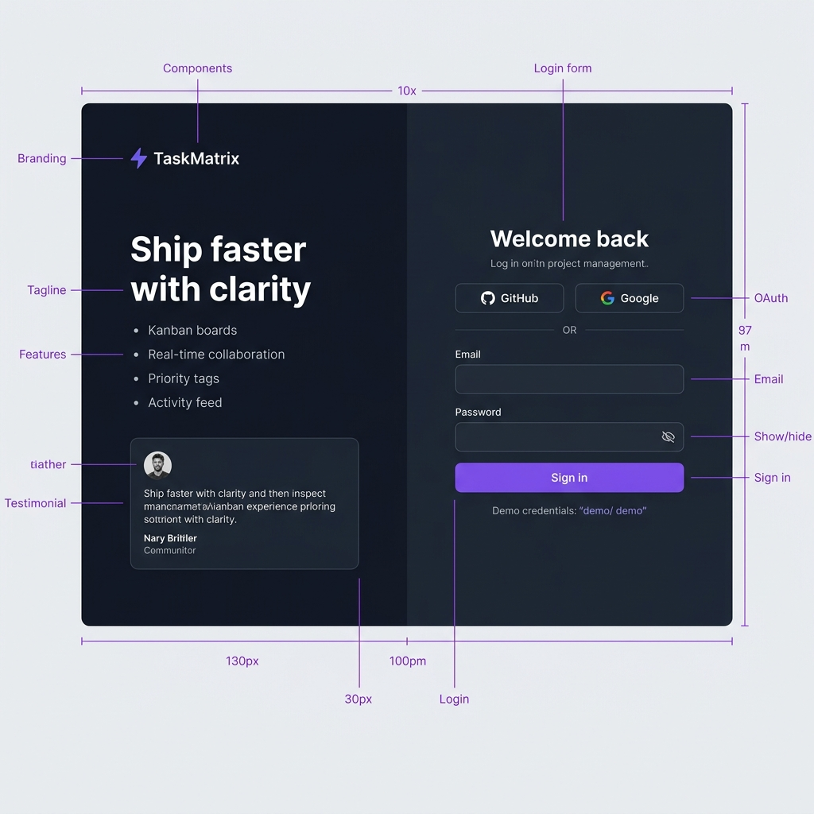
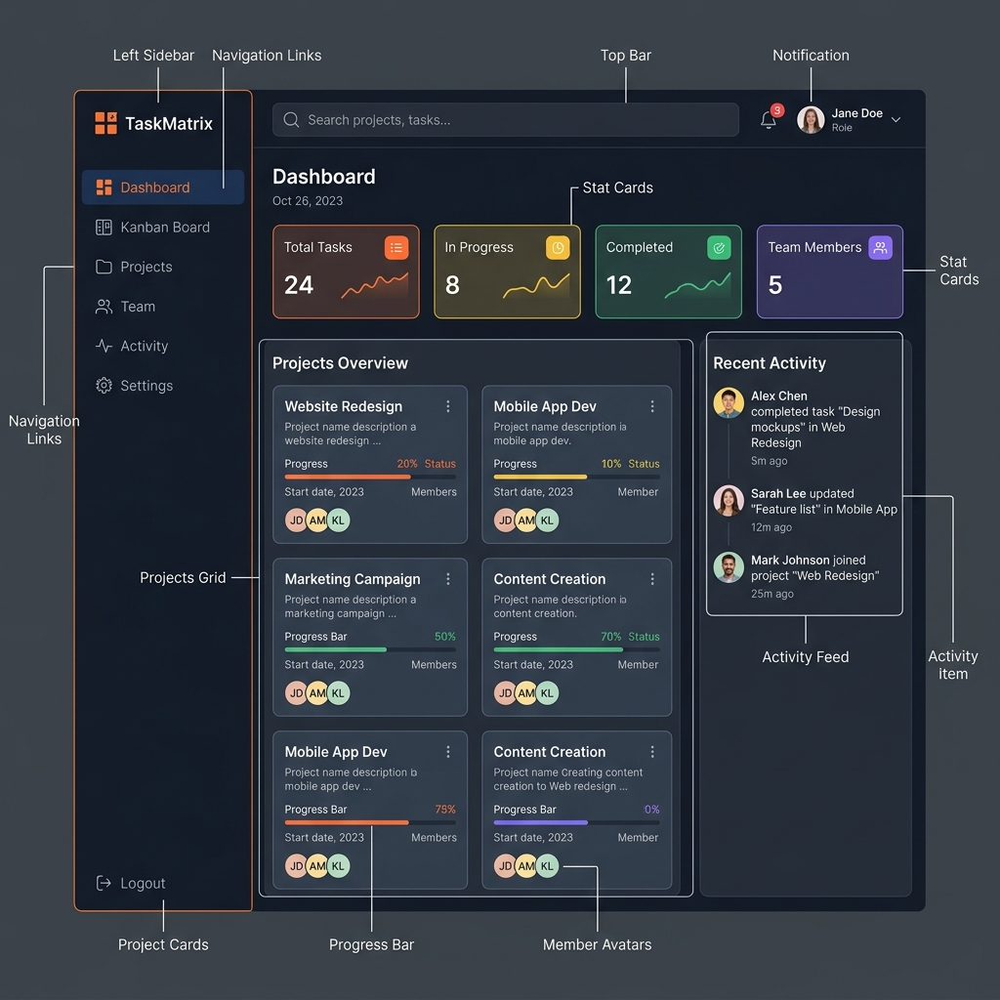
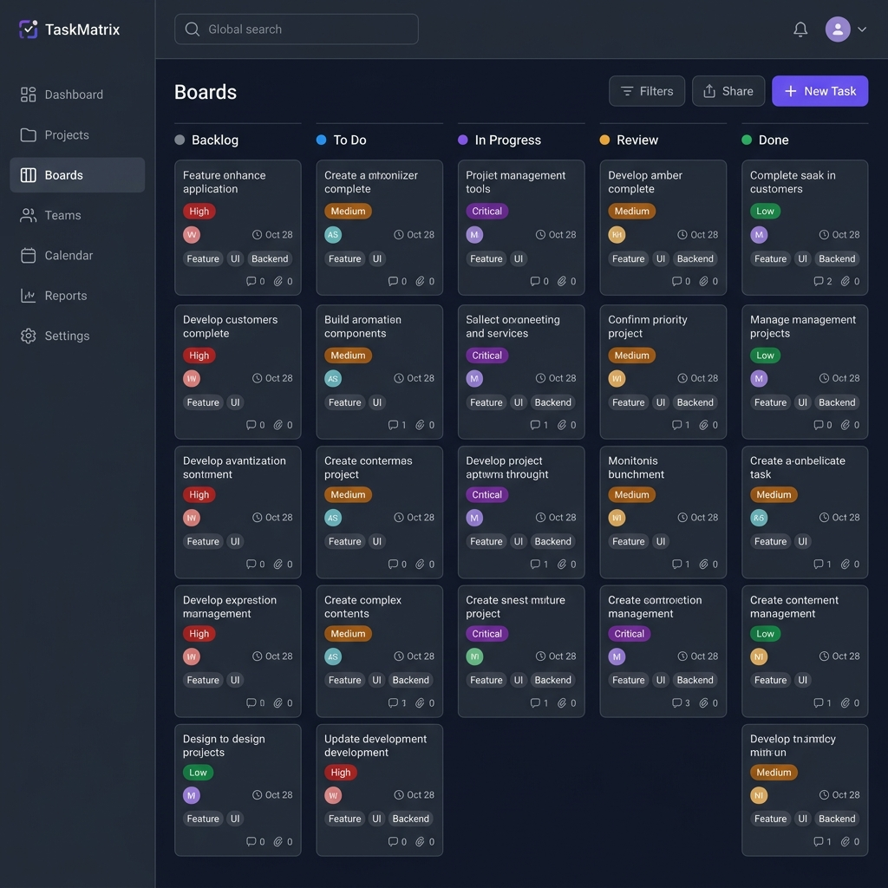
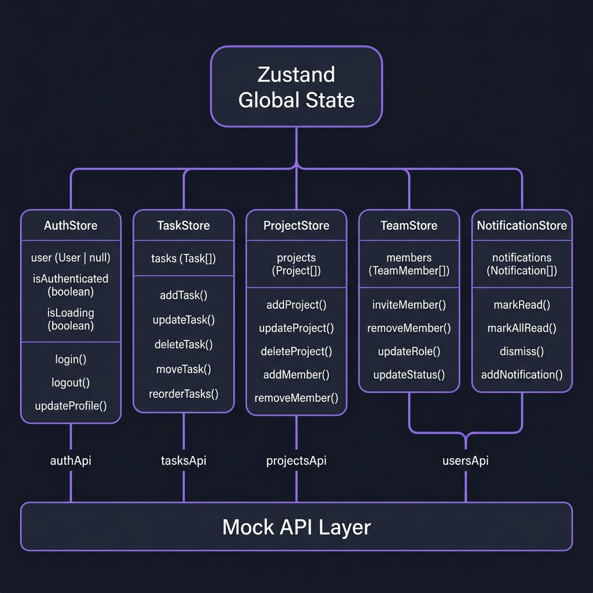

<div align="center">

# ⚡ TaskMatrix

### **A Modern Project Management Tool for Software Teams**

*Jira/Asana-inspired Kanban workspace — built as a Capstone project*

[](https://nextjs.org/)
[](https://react.dev/)
[](https://tailwindcss.com/)
[](https://www.typescriptlang.org/)
[](https://zustand-demo.pmnd.rs/)
[](https://supabase.com/)
[](https://recharts.org/)
[](https://prodesk-capstone-taskmatrix.vercel.app)

**🚀 Live Demo:** [prodesk-capstone-taskmatrix.vercel.app](https://prodesk-capstone-taskmatrix.vercel.app)

</div>

---

## 📋 Table of Contents

1. [Project Overview](#-project-overview)
2. [Track & Role](#-track--role)
3. [Tech Stack](#-tech-stack)
4. [Week 14 MVP — Auth & Routing](#-week-14-mvp--auth--routing)
5. [Week 15 — Full CRUD & Analytics](#-week-15--full-crud--analytics)
6. [Week 16 — Polish & AI Injection](#-week-16--polish--ai-injection)
7. [Core Features](#-core-features)
8. [UI Wireframes (Figma)](#-ui-wireframes)
9. [State Architecture Diagram](#-state-architecture-diagram)
10. [Data Models](#-data-models)
11. [Folder Structure](#-folder-structure)
12. [Development Timeline](#-development-timeline)
13. [Getting Started](#-getting-started)

---

## 🎯 Project Overview

**TaskMatrix** is a commercial-grade project management application inspired by tools like **Jira**, **Asana**, and **Linear**. It provides software teams with an intuitive Kanban-based workflow to organize tasks, track sprint progress, manage team members, and stay aligned on deadlines.

### Why TaskMatrix?

| Pain Point | TaskMatrix Solution |
|---|---|
| Scattered tasks across tools | Unified Kanban board with 5 status columns |
| No visibility into team workload | Dashboard with real-time stats & activity feed |
| Rigid project management tools | Drag-and-drop cards, inline editing, priority tags |
| Complex onboarding | Real Supabase auth — register and see your dashboard instantly |

### Target Users
- **Software development teams** (3–20 members)
- **Project managers** tracking sprint progress
- **Designers** collaborating on cross-functional projects
- **Freelancers** managing client deliverables

---

## 👤 Track & Role

| Field | Detail |
|---|---|
| **Track** | 🎨 **Frontend** (Track A) |
| **BaaS** | Supabase (Auth + PostgreSQL) |
| **Deployment** | Vercel (Frontend) |
| **Auth Strategy** | Supabase JS SDK v2 — localStorage session + client-side route guard |
| **Data Strategy** | Real auth (Supabase) + Mock content data (Zustand stores) for MVP |

> **Week 15:** Authentication is 100% real (Supabase). Task and Project data is now **persisted in Supabase** — full CRUD with Row Level Security enforcing ownership per user.

---

## 🛠 Tech Stack

| Layer | Technology | Purpose |
|---|---|---|
| **Framework** | Next.js 16 (App Router) | File-based routing, SSR/SSG, layouts |
| **UI Library** | React 19 | Component architecture |
| **Language** | TypeScript 5 | Type safety across the codebase |
| **Styling** | Tailwind CSS 4 | Utility-first CSS framework |
| **Component Library** | shadcn/ui (Radix primitives) | Accessible, themeable UI components |
| **State Management** | Zustand 5 | Lightweight global state with optimistic updates |
| **Auth / BaaS** | Supabase JS SDK v2 | Real user registration, login, session + PostgreSQL database |
| **Data Visualization** | Recharts 2 | AreaChart with gradient fills, status & priority breakdown |
| **Drag & Drop** | @hello-pangea/dnd | Kanban card reordering & column moves |
| **Icons** | Lucide React | Consistent, tree-shakeable icon set |
| **Theming** | next-themes | Dark / Light mode toggle with system preference |
| **Animations** | tw-animate-css | Micro-animations for UI polish |

---

## 🔐 Week 14 MVP — Auth & Routing

This section documents what was built and proven for the **Week 14 Walking Skeleton MVP**.

### What is a Walking Skeleton?
The thinnest possible version of the app that connects all major pieces end-to-end:
- User can **register** → real account created in Supabase
- User can **log in** → real session established
- User sees **their own name** on the dashboard (not "Guest" or mock data)
- Dashboard is **protected** — unauthenticated users redirected to login
- User can **sign out** → session cleared, redirected to login

### Milestone 1 — Layouts & Routing ✅

| Route | File | Description |
|---|---|---|
| `/` | `src/app/page.tsx` | Combined login/register page (tab-switched) |
| `/login` | `src/app/login/page.tsx` | Canonical redirect → `/` |
| `/register` | `src/app/register/page.tsx` | Canonical redirect → `/?mode=register` |
| `/dashboard` | `src/app/(app)/dashboard/page.tsx` | Protected — shows real user data |
| `/kanban` | `src/app/(app)/kanban/page.tsx` | Protected — Kanban board |
| `/projects` | `src/app/(app)/projects/page.tsx` | Protected — projects grid |
| `/team` | `src/app/(app)/team/page.tsx` | Protected — team members |
| `/settings` | `src/app/(app)/settings/page.tsx` | Protected — real profile editing |

### Milestone 2 — Authentication (Supabase) ✅

| Feature | Implementation |
|---|---|
| User registration | `supabase.auth.signUp({ email, password })` |
| User login | `supabase.auth.signInWithPassword({ email, password })` |
| Session persistence | Supabase stores session in localStorage automatically |
| Auth state listener | `supabase.auth.onAuthStateChange()` in `initializeAuth()` |
| Real error messages | Supabase error objects displayed in UI (wrong password, rate limit, etc.) |

### Milestone 3 — Protected Routes & Global State ✅

| Feature | Implementation |
|---|---|
| Route protection | `(app)/layout.tsx` — `useEffect` redirects to `/` if `!isAuthenticated` after `initialized` |
| Proxy/Middleware | `src/proxy.ts` — handles canonical `/login` → `/` and `/register` → `/?mode=register` |
| Global user state | Zustand `auth-store.ts` — stores `user.name`, `user.email`, `user.initials`, `supabaseUser.id` |
| Real name from email | `buildUserFromSupabase()` — derives display name from email (e.g. `john.doe@gmail.com` → "John Doe") |
| Dashboard greeting | `"Good morning, [FirstName] 👋"` — computed from real Supabase session |
| Topbar & Sidebar | Show real user name/email/initials — never "Guest" or "Alex Morgan" |
| Settings page | Profile fields pre-filled from real session; Save Changes syncs to Zustand |
| Change password | Calls `supabase.auth.updateUser({ password })` — real password update |

### How the Auth Flow Works

```
User visits /dashboard (not logged in)
        │
        ▼
(app)/layout.tsx → initializeAuth()
        │
        ▼
Supabase reads localStorage session
        │
        ├── Session found → buildUserFromSupabase() → set user in Zustand → render dashboard
        │
        └── No session → router.replace("/") → login page
```

### Environment Variables (Vercel + Local)

```env
NEXT_PUBLIC_SUPABASE_URL=https://rvvkkgihfwgfjymgurwc.supabase.co
NEXT_PUBLIC_SUPABASE_ANON_KEY=your_publishable_key_here
```

---

## ✅ Week 15 — Full CRUD & Analytics

Week 15 connects every button to the real Supabase database and adds data visualization.

### Milestone 1 — Create & Read ✅

| Feature | Implementation |
|---|---|
| Fetch tasks on login | `fetchTasksFromDB(userId)` → `SELECT * FROM tasks WHERE user_id = :uid` |
| Fetch projects on login | `fetchProjectsFromDB(userId)` → `SELECT * FROM projects WHERE user_id = :uid` |
| Create new task | `NewTaskDialog` → `createTaskInDB()` → `INSERT INTO tasks` |
| Create new project | `NewProjectDialog` → `createProjectInDB()` → `INSERT INTO projects` |
| Instant UI update | Zustand optimistic update — store updates before DB call resolves |
| Sidebar counts live | Tasks & Projects badge numbers read from Zustand store in real time |

### Milestone 2 — Update & Delete ✅

| Feature | Implementation |
|---|---|
| Edit task (pre-filled modal) | `EditTaskDialog` — fields synced from task object via `useEffect` |
| Save task edits | `updateTaskInDB()` — PATCH (only changed fields sent) |
| Edit project (pre-filled modal) | `EditProjectDialog` — name, description, color, due date pre-filled |
| Save project edits | `updateProjectInDB()` — PATCH |
| Delete with confirmation | `ConfirmDeleteDialog` — "Are you sure?" prompt before any delete |
| Delete task from DB | `deleteTaskFromDB(taskId)` → `DELETE FROM tasks WHERE id = :id` |
| Delete project from DB | `deleteProjectFromDB(projectId)` → `DELETE FROM projects WHERE id = :id` |
| Instant removal (no refresh) | `tasks.filter(t => t.id !== id)` in Zustand store |

### Milestone 3 — Analytics ✅

| Feature | Implementation |
|---|---|
| Chart library | **Recharts** — `AreaChart` with gradient fills |
| Tasks by day of week | Mon–Sun buckets computed with `.reduce()` from real task `createdAt` |
| Status distribution | Stacked horizontal bar — Done / In Progress / Review / To Do / Backlog |
| Priority breakdown | 4 mini cards — Critical / High / Medium / Low counts |
| KPI strip | Completion %, Active tasks, Total tasks — all live from Zustand |

### Supabase Schema

```sql
-- tasks table
create table tasks (
  id uuid primary key default gen_random_uuid(),
  user_id uuid references auth.users not null,
  title text not null,
  description text default '',
  status text default 'todo',
  priority text default 'medium',
  project_id uuid,
  due_date date,
  tags text[] default '{}',
  assignee_name text default 'You',
  assignee_initials text default 'YO',
  assignee_role text default 'developer',
  created_at timestamptz default now()
);

-- projects table
create table projects (
  id uuid primary key default gen_random_uuid(),
  user_id uuid references auth.users not null,
  name text not null,
  description text default '',
  color text default '#7c3aed',
  progress integer default 0,
  due_date date,
  created_at timestamptz default now()
);

-- Row Level Security (ownership)
alter table tasks    enable row level security;
alter table projects enable row level security;
create policy "tasks_own"    on tasks    for all using (auth.uid() = user_id);
create policy "projects_own" on projects for all using (auth.uid() = user_id);
```

---

## ✨ Week 16 — Polish & AI Injection

Week 16 focuses on elevating the application from a functional CRUD app to a professional SaaS product by integrating artificial intelligence and polishing the user experience.

### Milestone 1 — The AI Injection ✅

| Feature | Implementation |
|---|---|
| AI API | Google Gemini (`gemini-1.5-flash`) via `@google/genai` |
| Task Sub-steps | "✨ AI" button in Edit Task dialog auto-generates actionable sub-steps based on the task title |
| Project Milestones | "✨ AI" button in Edit Project dialog generates a high-level roadmap based on the project description |
| Robustness | Built-in fallback mechanisms if API quota is exceeded |

### Milestone 2 — The Mobile Polish ✅

| Feature | Implementation |
|---|---|
| Hamburger Menu | Responsive sidebar collapses into a mobile "Sheet" drawer |
| Horizontal Scroll | Kanban board columns stack vertically or scroll horizontally via `overflow-x-auto` |
| Floating Dropdowns | All `<Select>` and `<DropdownMenu>` components use `createPortal` with `position: fixed` to float over overflow boundaries |
| Responsive Dialogs | Dialog contents properly scroll independently of headers/footers |

### Milestone 3 — Micro-Interactions ✅

| Feature | Implementation |
|---|---|
| Toast Notifications | Integrated `sonner` for sleek, modern toasts (replaces all raw `alert()` popups) |
| Loading States | Spinner `Loader2` during auth validation and form submissions |
| Empty States | Beautiful, icon-driven "No Data" screens for 0 tasks, 0 projects, and 0 team members |

---

## ✨ Core Features

### 🔐 Authentication & Access Control
- [x] Register with email + password (real Supabase account created)
- [x] Login with email + password (real Supabase session)
- [x] Real user name/email shown in dashboard, sidebar, topbar, settings
- [x] Route guards — unauthenticated users redirected to login
- [x] Sign out clears session and redirects
- [x] Supabase error messages shown in UI (wrong password, rate limits, etc.)
- [x] `buildUserFromSupabase()` — derives full name & initials from email for any real user
- [x] Role-based user model: `admin`, `manager`, `developer`, `designer`

### 📊 Dashboard
- [x] **3 stat cards** — Total Tasks, Completed, Pending (all live from Zustand — update instantly on CRUD)
- [x] Personalized greeting: `"Good morning, [FirstName] 👋"`
- [x] Subtitle: "X of Y tasks complete across Z projects" — live counts
- [x] **Task Analytics chart** (Recharts AreaChart) — Tasks by day, status %, priority grid
- [x] Project overview cards with progress bars
- [x] Real-time activity feed
- [x] Quick-action buttons (New Task, New Project)

### 📋 Kanban Board
- [x] **5-column board** — Backlog → To Do → In Progress → Review → Done
- [x] **Drag-and-drop** task cards between columns and within columns
- [x] Task cards showing: title, priority badge, assignee avatar, due date, tags
- [x] Color-coded priority levels: `Critical` (red), `High` (orange), `Medium` (yellow), `Low` (slate)
- [x] **Create** tasks via `NewTaskDialog` — persists to Supabase, instant UI update
- [x] **Edit** tasks via `EditTaskDialog` — pre-filled modal, PATCH to Supabase
- [x] **Delete** tasks with confirmation dialog — removed from DB and UI
- [x] Sidebar Tasks badge updates live when tasks are added/deleted

### 📁 Projects Management
- [x] Projects grid with color accent bars, progress bars, member avatars
- [x] **Click card body** navigates to Kanban board
- [x] **⋯ menu** — Edit project (pre-filled dialog), Delete project (confirm dialog)
- [x] **Create** new projects (name, description, color, due date, custom team members)
- [x] **Edit** project name, description, color, due date — persists to Supabase
- [x] **Delete** project with confirmation — removed from DB and UI instantly
- [x] Due date formatted as "May 30, 2025" (not raw ISO)
- [x] Sidebar Projects badge updates live when projects are added/deleted

### 👥 Team Management
- [x] **Real users** — new registered accounts see only themselves (no fake team)
- [x] **Mock demo users** shown only when logged in as alex@taskmatrix.io
- [x] **Invite Member dialog** — name + email form, invited member appears immediately
- [x] **Edit Member** — update name, role, email via edit dialog
- [x] **Remove Member** — confirmation dialog, removed from team list
- [x] Search team by name, role, or email
- [x] Per-member workload stats (done, active, critical tasks)

### 🔔 Notifications
- [x] Notification dropdown panel in topbar
- [x] Unread count badge
- [x] Mark individual / all as read
- [x] Dismiss and clear all notifications

### ⚙️ Settings
- [x] Profile editing — name/email pre-filled from real Supabase session
- [x] Save Changes syncs name to topbar/sidebar instantly via Zustand
- [x] Change Password — calls `supabase.auth.updateUser()` (real password change)
- [x] Role field shows real role from auth store
- [x] Theme preferences (dark/light via toggle)

---

## 🖼 UI Wireframes

> **Figma Link:** [https://www.figma.com/design/3zV5KLsWPe9ev8SFO9bcp4/capstone-project-design?node-id=2-503&t=wqZuKGeKeZHaULHE-1]

### Screen 1 — Login Page


**Key Elements:**
- Split-panel layout: brand panel (left) + form panel (right)
- Email/password form with visibility toggle
- Register tab to create a new account
- Responsive: brand panel hides on mobile

---

### Screen 2 — Dashboard


**Key Elements:**
- Persistent sidebar navigation (6 routes)
- Real user name in greeting header and sidebar user card
- 4 live stat cards (computed from Zustand store)
- Project cards grid with progress bars

---

### Screen 3 — Kanban Board


**Key Elements:**
- 5-column drag-and-drop board (Backlog → Done)
- Task cards with priority badges, assignee avatars, due dates
- "New Task" dialog to create tasks

---

## 🏗 State Architecture Diagram



### Store Breakdown

```
Zustand Global State
├── AuthStore                           ← REAL (Supabase)
│   ├── user: User | null               ← built from Supabase session
│   ├── supabaseUser: { id, email }     ← raw Supabase user
│   ├── isAuthenticated: boolean
│   ├── initialized: boolean            ← true after first session check
│   └── Actions: login(), logout(), register(),
│                initializeAuth(), updateProfile()
│
├── TaskStore                           ← REAL (Supabase Week 15 ✅)
│   ├── tasks: Task[]
│   └── Actions: addTask(), updateTask(), deleteTask(),
│                moveTask(), reorderTasks(), fetchTasks()
│
├── ProjectStore                        ← REAL (Supabase Week 15 ✅)
│   ├── projects: Project[]
│   └── Actions: addProject(), updateProject(), deleteProject(),
│                fetchProjects()
│
├── TeamStore                           ← Session-only (invited members)
│   ├── invitedMembers: User[]
│   └── Actions: inviteMember(), updateMember(), removeMember()
│
└── NotificationStore
    ├── notifications: Notification[]
    └── Actions: markRead(), markAllRead(),
                 dismiss(), clearAll()
```

### Selector Hooks

| Hook | Returns | Store |
|---|---|---|
| `useCurrentUser()` | Authenticated User object | AuthStore |
| `useSupabaseUser()` | Raw `{ id, email }` from Supabase | AuthStore |
| `useIsAuthenticated()` | Auth status boolean | AuthStore |
| `useTasks()` | All tasks | TaskStore |
| `useTasksByStatus(status)` | Filtered tasks by column | TaskStore |
| `useProjects()` | All projects | ProjectStore |
| `useInvitedMembers()` | Members invited this session | TeamStore |
| `useNotifications()` | All notifications | NotificationStore |
| `useUnreadCount()` | Unread notification count | NotificationStore |

---

## 🔌 Mock API Endpoints

The `src/lib/api.ts` module simulates a RESTful API with realistic delays (300ms default, 800ms for auth). This allows the UI code to remain **identical to a real API integration** — simply swap the internals for `fetch()` calls when adding a real backend.

> **Note:** Auth (`authApi`) is deprecated for direct UI use — the Supabase SDK is called directly from `auth-store.ts`. `api.ts` is kept as a reference layer for future Supabase table connectivity.

### Tasks API
| Method | Endpoint | Description |
|---|---|---|
| `GET` | `/api/tasks` | List all tasks |
| `POST` | `/api/tasks` | Create a new task |
| `PATCH` | `/api/tasks/:id` | Update task fields |
| `DELETE` | `/api/tasks/:id` | Delete a task |
| `PATCH` | `/api/tasks/:id/move` | Move task to new column |

### Projects API
| Method | Endpoint | Description |
|---|---|---|
| `GET` | `/api/projects` | List all projects |
| `POST` | `/api/projects` | Create a new project |
| `PATCH` | `/api/projects/:id` | Update project |
| `DELETE` | `/api/projects/:id` | Delete a project |

### Users / Team API
| Method | Endpoint | Description |
|---|---|---|
| `GET` | `/api/users` | List invited members |
| `POST` | `/api/users/invite` | Invite a new member |
| `DELETE` | `/api/users/:id` | Remove a member |

---

## 📐 Data Models

### User
```typescript
interface User {
  id: string;          // "u1" for mock, Supabase UUID for real users
  name: string;        // Derived from email if real user: "john.doe" → "John Doe"
  email: string;       // Real email from Supabase session
  avatar: string;      // URL or empty
  role: Role;          // "admin" | "manager" | "developer" | "designer"
  initials: string;    // Derived: "John Doe" → "JD"
}
```

### Task (mock — Week 15: connect to Supabase `tasks` table)
```typescript
interface Task {
  id: string;
  title: string;
  description: string;
  status: TaskStatus;  // "backlog" | "todo" | "in-progress" | "review" | "done"
  priority: Priority;  // "low" | "medium" | "high" | "critical"
  assignee: User;
  projectId: string;
  dueDate: string;
  tags: string[];
  createdAt: string;
  comments: number;
  attachments: number;
}
```

### Project (mock — Week 15: connect to Supabase `projects` table)
```typescript
interface Project {
  id: string;
  name: string;
  description: string;
  color: string;       // hex color for card accent
  progress: number;    // 0-100
  taskCount: number;
  members: User[];     // custom members added by the user
  createdAt: string;
  dueDate: string;
}
```

---

## 📂 Folder Structure

```
prodesk-capstone-taskmatrix/
├── docs/
│   ├── wireframes/
│   │   ├── 01-login-page.png
│   │   ├── 02-dashboard.png
│   │   └── 03-kanban-board.png
│   └── state-architecture.png
├── public/
│   └── favicon.ico
├── src/
│   ├── app/
│   │   ├── (app)/                    # Protected route group
│   │   │   ├── dashboard/page.tsx    # Dashboard with real greeting + stats
│   │   │   ├── kanban/page.tsx       # Kanban board with drag-and-drop
│   │   │   ├── projects/page.tsx     # Project grid (clickable cards)
│   │   │   ├── team/page.tsx         # Team — shows real user or mock demo
│   │   │   ├── activity/page.tsx     # Activity feed log
│   │   │   ├── settings/page.tsx     # Real profile + Change Password
│   │   │   └── layout.tsx            # Auth guard (initializeAuth + redirect)
│   │   ├── login/page.tsx            # Canonical redirect → /
│   │   ├── register/page.tsx         # Canonical redirect → /?mode=register
│   │   ├── page.tsx                  # Login/Register combined page (Supabase auth)
│   │   ├── layout.tsx                # Root layout (theme provider, fonts)
│   │   └── globals.css               # Tailwind config + CSS variables
│   ├── components/
│   │   ├── ui/                       # shadcn/ui primitives
│   │   ├── sidebar.tsx               # Sidebar with real user card
│   │   ├── topbar.tsx                # Topbar with real user avatar/name
│   │   ├── invite-member-dialog.tsx  # Invite member form (name + email)
│   │   ├── new-project-dialog.tsx    # Create project (free-text member input)
│   │   ├── new-task-dialog.tsx       # Create task form modal
│   │   ├── edit-task-dialog.tsx      # Edit task form modal
│   │   ├── notifications-panel.tsx   # Notification dropdown panel
│   │   ├── live-dashboard-stats.tsx  # Animated stat cards
│   │   ├── task-badges.tsx           # Priority & status badge components
│   │   ├── theme-toggle.tsx          # Dark/Light mode switch
│   │   └── theme-provider.tsx        # next-themes provider wrapper
│   ├── store/
│   │   ├── index.ts                  # Central re-export barrel
│   │   ├── auth-store.ts             # Real Supabase auth + Zustand state
│   │   ├── task-store.ts             # Task CRUD + drag-and-drop
│   │   ├── project-store.ts          # Project CRUD + custom members
│   │   ├── team-store.ts             # Invited members state
│   │   └── notification-store.ts     # In-app notifications
│   ├── lib/
│   │   ├── data.ts                   # Type definitions + mock data
│   │   ├── api.ts                    # Mock API reference layer
│   │   ├── supabase.ts               # Supabase client (createClient)
│   │   └── utils.ts                  # Utility functions (cn helper)
│   └── proxy.ts                      # Next.js 16 middleware (route redirects)
├── AGENTS.md                         # AI coding assistant rules
├── prompts.md                        # Prompts used during development
├── video-script.md                   # Demo video script
├── package.json
├── tsconfig.json
└── README.md
```

---

## 📅 Development Timeline

| Week | Phase | Status | Deliverables |
|---|---|---|---|
| **Week 13** | 📐 Planning & Design | ✅ Done | PRD (README), Wireframes, State Architecture Diagram |
| **Week 14** | 🏗 MVP / Walking Skeleton | ✅ Done | Supabase auth, protected routes, real user profile, deployed to Vercel |
| **Week 15** | ✅ Full CRUD & Analytics | ✅ Done | Supabase tasks/projects tables, full Create/Read/Update/Delete, Recharts analytics, live sidebar counts, edit/delete with confirmation dialogs |
| **Week 16** | 🤖 AI & Polish | ✅ Done | Gemini AI integration, UI polishes, Sonner toasts, empty states, responsive Kanban, Floating dropdowns |
| **Week 17** | 🚀 Final Deployment | 🔜 Upcoming | Final QA, demo video, presentation |

---

## 🚀 Getting Started

### Prerequisites
- **Node.js** ≥ 18.x
- **npm** ≥ 9.x
- A **Supabase** project (or use the existing one via env vars)

### Installation

```bash
# Clone the repository
git clone https://github.com/yashsoni1110/prodesk-capstone-taskmatrix.git
cd prodesk-capstone-taskmatrix

# Install dependencies
npm install

# Create environment file
cp .env.local.example .env.local
# Add your Supabase URL and key

# Start the development server
npm run dev
```

### Environment Variables

```env
NEXT_PUBLIC_SUPABASE_URL=https://your-project.supabase.co
NEXT_PUBLIC_SUPABASE_KEY=your_publishable_anon_key
```

Open [http://localhost:3000](http://localhost:3000) — register a new account or use the demo below.

### Demo Credentials (Mock User)

| Field | Value |
|---|---|
| Email | `alex@taskmatrix.io` |
| Password | *(set in your Supabase dashboard)* |

> **New users:** Register with any email at [http://localhost:3000](http://localhost:3000) — a real Supabase account will be created and you'll land on your personal dashboard.

---

<div align="center">

**Built with ❤️ as a Capstone Project — Week 16 Polish Complete**

*TaskMatrix — Ship faster with clarity.*

[](https://prodesk-capstone-taskmatrix.vercel.app)

</div>
